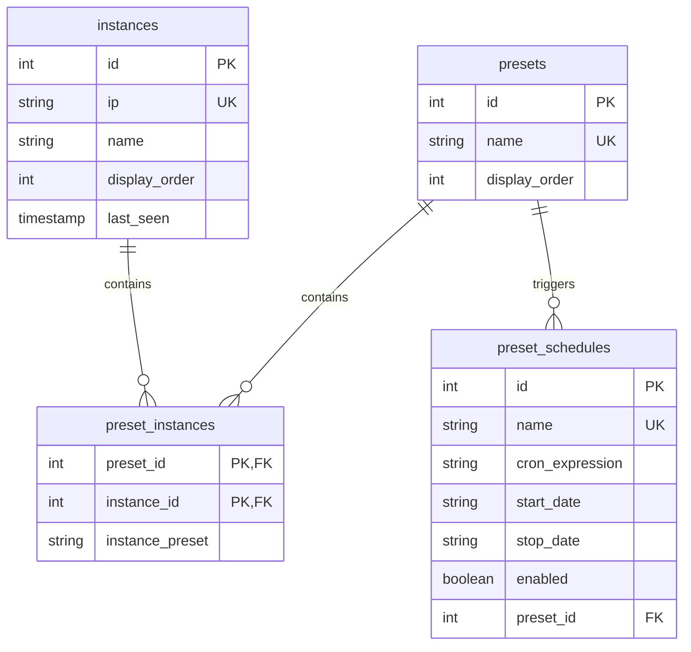

# WLED Control Backend API

A secure Node.js API for managing and controlling multiple WLED LED devices, enabling one-click preset application and automation.

## Table of Contents

- [Features](#features)
- [API Endpoints](#api-endpoints)
    - [Authentication](#authentication)
    - [Instance Management](#instance-management)
    - [Preset Management](#preset-management)
    - [Schedule Management](#schedule-management)
    - [WLED Device Interaction](#wled-device-interaction)
- [Error Handling](#error-handling)
- [Database Schema](#database-schema)
- [Environment Variables](#environment-variables)
- [Setup](#setup)
- [Troubleshooting/FAQ](#troubleshootingfaq)

## Features

- **Device Proxying**: Forwards commands to WLED devices (e.g., `/json/state` for state changes).
- **SQLite Database**: Stores instances, presets, and schedules with foreign key constraints.
- **Input Validation**: Validates IP addresses, WLED compatibility, and cron expressions.
- **Automation**: Schedules preset application using `node-cron`.
- **Security**: Enforces API key authentication, rate limiting, and secure headers via `helmet`.

## API Endpoints

Base URL: `http://your-server:3000`

### Authentication

All endpoints require authentication:

- **Header**: `X-API-Key: your-secure-api-key-123`
- **Query Parameter**: `?apiKey=your-secure-api-key-123`
- **Error**: `401 Unauthorized` if key is invalid or missing.

Click below to expand endpoint details. Each section includes request inputs, response formats, and examples.

<details>
<summary><h3>Instance Management</h3></summary>

Endpoints for managing WLED device instances (e.g., adding, updating, reordering).

#### GET /api/instances

**Description**: Retrieves all WLED instances, sorted by `display_order`.

**Request**:
- **Method**: GET
- **Headers**:
    - `X-API-Key`: Required
- **Parameters**: None

**Response**:
- **200 OK**:
  ```json
  [
    {
      "id": 1,
      "ip": "192.168.1.100",
      "name": "Living Room",
      "display_order": 0,
      "last_seen": "2025-09-07T21:34:00Z"
    }
  ]
  ```
- **401 Unauthorized**: `{ "error": "Unauthorized" }`
- **500 Server Error**: `{ "error": "Failed to retrieve instances" }`

**Example**:
```bash
curl -H "X-API-Key: your-key" http://your-server:3000/api/instances
```

#### POST /api/instances

**Description**: Creates a new WLED instance after validating IP and WLED compatibility.

**Request**:
- **Method**: POST
- **Headers**:
    - `X-API-Key`: Required
    - `Content-Type: application/json`
- **Body**:
  | Field | Type   | Description                     | Required |
  |-------|--------|---------------------------------|----------|
  | ip    | String | Valid IPv4 (e.g., `192.168.1.100`) | Yes      |
  | name  | String | Instance name                   | No       |
  ```json
  {
    "ip": "192.168.1.100",
    "name": "Living Room"
  }
  ```

**Response**:
- **200 OK**:
  ```json
  {
    "id": 1,
    "ip": "192.168.1.100",
    "name": "Living Room",
    "display_order": 0,
    "last_seen": "2025-09-07T21:34:00Z"
  }
  ```
- **400 Bad Request**: `{ "error": "Invalid IP address format" }` or `{ "error": "Could not connect to WLED device at this IP" }`
- **409 Conflict**: `{ "error": "Instance with this IP already exists" }`
- **500 Server Error**: `{ "error": "Failed to create instance" }`

**Example**:
```bash
curl -X POST -H "X-API-Key: your-key" -H "Content-Type: application/json" \
     -d '{"ip":"192.168.1.100","name":"Living Room"}' http://your-server:3000/api/instances
```

#### PUT /api/instances/{id}

**Description**: Updates an instance’s IP or name; re-validates IP if provided.

**Request**:
- **Method**: PUT
- **Headers**:
    - `X-API-Key`: Required
    - `Content-Type: application/json`
- **Parameters**:
    - `id`: Integer (e.g., `1`)
- **Body**:
  | Field | Type   | Description                     | Required |
  |-------|--------|---------------------------------|----------|
  | ip    | String | Valid IPv4                      | No       |
  | name  | String | Instance name                   | No       |
  ```json
  {
    "ip": "192.168.1.101",
    "name": "Bedroom"
  }
  ```

**Response**:
- **200 OK**:
  ```json
  {
    "id": 1,
    "ip": "192.168.1.101",
    "name": "Bedroom",
    "display_order": 0,
    "last_seen": "2025-09-07T21:34:00Z"
  }
  ```
- **400 Bad Request**: `{ "error": "Invalid IP address format" }` or `{ "error": "Could not connect to WLED device at this IP" }`
- **404 Not Found**: `{ "error": "Instance not found" }`
- **409 Conflict**: `{ "error": "Instance with this IP already exists" }`
- **500 Server Error**: `{ "error": "Failed to update instance" }`

**Example**:
```bash
curl -X PUT -H "X-API-Key: your-key" -H "Content-Type: application/json" \
     -d '{"name":"Bedroom"}' http://your-server:3000/api/instances/1
```

#### DELETE /api/instances/{id}

**Description**: Deletes an instance and removes orphaned presets.

**Request**:
- **Method**: DELETE
- **Headers**:
    - `X-API-Key`: Required
- **Parameters**:
    - `id`: Integer (e.g., `1`)

**Response**:
- **200 OK**: `{ "success": true }`
- **404 Not Found**: `{ "error": "Instance not found" }`
- **500 Server Error**: `{ "error": "Failed to delete instance" }`

**Example**:
```bash
curl -X DELETE -H "X-API-Key: your-key" http://your-server:3000/api/instances/1
```

#### POST /api/instances/reorder

**Description**: Reorders instances by updating `display_order`.

**Request**:
- **Method**: POST
- **Headers**:
    - `X-API-Key`: Required
    - `Content-Type: application/json`
- **Body**:
  | Field      | Type      | Description                  | Required |
  |------------|-----------|------------------------------|----------|
  | orderedIds | Integer[] | Array of instance IDs in order | Yes      |
  ```json
  {
    "orderedIds": [3, 1, 2]
  }
  ```

**Response**:
- **200 OK**:
  ```json
  [
    {
      "id": 3,
      "ip": "192.168.1.103",
      "name": "Kitchen",
      "display_order": 0,
      "last_seen": "2025-09-07T21:34:00Z"
    }
  ]
  ```
- **400 Bad Request**: `{ "error": "orderedIds must be a non-empty array of instance IDs" }`
- **500 Server Error**: `{ "error": "Failed to reorder instances" }`

**Example**:
```bash
curl -X POST -H "X-API-Key: your-key" -H "Content-Type: application/json" \
     -d '{"orderedIds":[3,1,2]}' http://your-server:3000/api/instances/reorder
```

</details>

<details>
<summary><h3>Preset Management</h3></summary>

Endpoints for creating, updating, and applying presets to control multiple WLED devices.

#### GET /api/presets

**Description**: Retrieves all presets with instance counts, sorted by `display_order`.

**Request**:
- **Method**: GET
- **Headers**:
    - `X-API-Key`: Required
- **Parameters**: None

**Response**:
- **200 OK**:
  ```json
  [
    {
      "id": 1,
      "name": "Evening Glow",
      "display_order": 0,
      "instance_count": 2
    }
  ]
  ```
- **500 Server Error**: `{ "error": "Failed to retrieve presets" }`

**Example**:
```bash
curl -H "X-API-Key: your-key" http://your-server:3000/api/presets
```

#### GET /api/presets/{id}

**Description**: Retrieves a preset with its associated instances and settings.

**Request**:
- **Method**: GET
- **Headers**:
    - `X-API-Key`: Required
- **Parameters**:
    - `id`: Integer (e.g., `1`)

**Response**:
- **200 OK**:
  ```json
  {
    "id": 1,
    "name": "Evening Glow",
    "instances": [
      {
        "instance_id": 1,
        "instance_name": "Living Room",
        "instance_ip": "192.168.1.100",
        "instance_preset": { "on": true, "bri": 200 }
      }
    ]
  }
  ```
- **404 Not Found**: `{ "error": "Preset not found" }`
- **500 Server Error**: `{ "error": "Failed to retrieve preset" }`

**Example**:
```bash
curl -H "X-API-Key: your-key" http://your-server:3000/api/presets/1
```

#### POST /api/presets

**Description**: Creates a preset with associated instances.

**Request**:
- **Method**: POST
- **Headers**:
    - `X-API-Key`: Required
    - `Content-Type: application/json`
- **Body**:
  | Field     | Type          | Description                       | Required |
  |-----------|---------------|-----------------------------------|----------|
  | name      | String        | Unique preset name                | Yes      |
  | instances | Object[]      | Array of instance settings        | No       |
  | instances[].instance_id | Integer | Instance ID                     | Yes      |
  | instances[].instance_preset | Object | WLED state (e.g., `{ "on": true }`) | No       |
  ```json
  {
    "name": "Evening Glow",
    "instances": [
      { "instance_id": 1, "instance_preset": { "on": true, "bri": 200 } }
    ]
  }
  ```

**Response**:
- **200 OK**: Created preset (same structure as `GET /api/presets/{id}`).
- **400 Bad Request**: `{ "error": "Name is required" }` or `{ "error": "Invalid instance data" }`
- **409 Conflict**: `{ "error": "Preset with this name already exists" }`
- **500 Server Error**: `{ "error": "Failed to create preset" }`

**Example**:
```bash
curl -X POST -H "X-API-Key: your-key" -H "Content-Type: application/json" \
     -d '{"name":"Evening Glow","instances":[{"instance_id":1,"instance_preset":{"on":true,"bri":200}}]}' \
     http://your-server:3000/api/presets
```

#### PUT /api/presets/{id}

**Description**: Updates a preset’s name or instances.

**Request**:
- **Method**: PUT
- **Headers**:
    - `X-API-Key`: Required
    - `Content-Type: application/json`
- **Parameters**:
    - `id`: Integer (e.g., `1`)
- **Body**:
  | Field     | Type          | Description                       | Required |
  |-----------|---------------|-----------------------------------|----------|
  | name      | String        | Unique preset name                | No       |
  | instances | Object[]      | Array of instance settings        | No       |
  ```json
  {
    "name": "Night Glow",
    "instances": [
      { "instance_id": 1, "instance_preset": { "on": true, "bri": 180 } }
    ]
  }
  ```

**Response**:
- **200 OK**: Updated preset (same structure as `GET /api/presets/{id}`).
- **400 Bad Request**: `{ "error": "Invalid instance data" }`
- **404 Not Found**: `{ "error": "Preset not found" }`
- **409 Conflict**: `{ "error": "Preset with this name already exists" }`
- **500 Server Error**: `{ "error": "Failed to update preset" }`

**Example**:
```bash
curl -X PUT -H "X-API-Key: your-key" -H "Content-Type: application/json" \
     -d '{"name":"Night Glow"}' http://your-server:3000/api/presets/1
```

#### DELETE /api/presets/{id}

**Description**: Deletes a preset and its associated schedules/cron jobs.

**Request**:
- **Method**: DELETE
- **Headers**:
    - `X-API-Key`: Required
- **Parameters**:
    - `id`: Integer (e.g., `1`)

**Response**:
- **200 OK**: `{ "success": true }`
- **404 Not Found**: `{ "error": "Preset not found" }`
- **500 Server Error**: `{ "error": "Failed to delete preset" }`

**Example**:
```bash
curl -X DELETE -H "X-API-Key: your-key" http://your-server:3000/api/presets/1
```

#### POST /api/presets/{id}/apply

**Description**: Applies a preset to its associated instances.

**Request**:
- **Method**: POST
- **Headers**:
    - `X-API-Key`: Required
- **Parameters**:
    - `id`: Integer (e.g., `1`)

**Response**:
- **200 OK**:
  ```json
  {
    "success": true,
    "message": "Preset \"Evening Glow\" applied to 2 instances",
    "results": [
      {
        "instance_id": 1,
        "instance_name": "Living Room",
        "success": true,
        "result": { "success": true }
      },
      {
        "instance_id": 2,
        "instance_name": "Bedroom",
        "success": false,
        "error": "Device not responding"
      }
    ]
  }
  ```
- **404 Not Found**: `{ "error": "Preset not found" }`
- **500 Server Error**: `{ "error": "Failed to apply preset" }`

**Example**:
```bash
curl -X POST -H "X-API-Key: your-key" http://your-server:3000/api/presets/1/apply
```

#### POST /api/presets/reorder

**Description**: Reorders presets by updating `display_order`.

**Request**:
- **Method**: POST
- **Headers**:
    - `X-API-Key`: Required
    - `Content-Type: application/json`
- **Body**:
  | Field      | Type      | Description                  | Required |
  |------------|-----------|------------------------------|----------|
  | orderedIds | Integer[] | Array of preset IDs in order | Yes      |
  ```json
  {
    "orderedIds": [2, 1, 3]
  }
  ```

**Response**:
- **200 OK**:
  ```json
  [
    {
      "id": 2,
      "name": "Morning Light",
      "display_order": 0,
      "instance_count": 1
    }
  ]
  ```
- **400 Bad Request**: `{ "error": "orderedIds must be a non-empty array of preset IDs" }`
- **500 Server Error**: `{ "error": "Failed to reorder presets" }`

**Example**:
```bash
curl -X POST -H "X-API-Key: your-key" -H "Content-Type: application/json" \
     -d '{"orderedIds":[2,1,3]}' http://your-server:3000/api/presets/reorder
```

</details>

<details>
<summary><h3>Schedule Management</h3></summary>

Endpoints for managing cron-based schedules to automate preset application.

#### GET /api/schedules

**Description**: Retrieves all schedules with associated preset names.

**Request**:
- **Method**: GET
- **Headers**:
    - `X-API-Key`: Required
- **Parameters**: None

**Response**:
- **200 OK**:
  ```json
  [
    {
      "id": 1,
      "name": "Evening Schedule",
      "cron_expression": "0 18 * * *",
      "start_date": "2025-09-01",
      "stop_date": null,
      "enabled": 1,
      "preset_id": 1,
      "preset_name": "Evening Glow"
    }
  ]
  ```
- **500 Server Error**: `{ "error": "Failed to retrieve schedules" }`

**Example**:
```bash
curl -H "X-API-Key: your-key" http://your-server:3000/api/schedules
```

#### GET /api/schedules/{id}

**Description**: Retrieves a schedule with its preset name.

**Request**:
- **Method**: GET
- **Headers**:
    - `X-API-Key`: Required
- **Parameters**:
    - `id`: Integer (e.g., `1`)

**Response**:
- **200 OK**:
  ```json
  {
    "id": 1,
    "name": "Evening Schedule",
    "cron_expression": "0 18 * * *",
    "start_date": "2025-09-01",
    "stop_date": null,
    "enabled": 1,
    "preset_id": 1,
    "preset_name": "Evening Glow"
  }
  ```
- **404 Not Found**: `{ "error": "Schedule not found" }`
- **500 Server Error**: `{ "error": "Failed to retrieve schedule" }`

**Example**:
```bash
curl -H "X-API-Key: your-key" http://your-server:3000/api/schedules/1
```

#### POST /api/schedules

**Description**: Creates a schedule for automated preset application.

**Request**:
- **Method**: POST
- **Headers**:
    - `X-API-Key`: Required
    - `Content-Type: application/json`
- **Body**:
  | Field          | Type    | Description                          | Required |
  |----------------|---------|--------------------------------------|----------|
  | name           | String  | Unique schedule name                 | Yes      |
  | cron_expression| String  | Valid cron string (e.g., `0 18 * * *`) | Yes      |
  | start_date     | String  | ISO 8601 date (e.g., `2025-09-01`)   | No       |
  | stop_date      | String  | ISO 8601 date                        | No       |
  | enabled        | Boolean | Enable schedule (default: true)      | No       |
  | preset_id      | Integer | Existing preset ID                   | Yes      |
  ```json
  {
    "name": "Evening Schedule",
    "cron_expression": "0 18 * * *",
    "start_date": "2025-09-01",
    "enabled": true,
    "preset_id": 1
  }
  ```

**Response**:
- **200 OK**: Created schedule (same structure as `GET /api/schedules/{id}`).
- **400 Bad Request**: `{ "error": "Invalid cron expression" }` or `{ "error": "Preset not found" }`
- **409 Conflict**: `{ "error": "Schedule with this name already exists" }`
- **500 Server Error**: `{ "error": "Failed to create schedule" }`

**Example**:
```bash
curl -X POST -H "X-API-Key: your-key" -H "Content-Type: application/json" \
     -d '{"name":"Evening Schedule","cron_expression":"0 18 * * *","preset_id":1}' \
     http://your-server:3000/api/schedules
```

#### PUT /api/schedules/{id}

**Description**: Updates a schedule; restarts cron job if enabled.

**Request**:
- **Method**: PUT
- **Headers**:
    - `X-API-Key`: Required
    - `Content-Type: application/json`
- **Parameters**:
    - `id`: Integer (e.g., `1`)
- **Body**:
  | Field          | Type    | Description                          | Required |
  |----------------|---------|--------------------------------------|----------|
  | name           | String  | Unique schedule name                 | No       |
  | cron_expression| String  | Valid cron string                    | No       |
  | start_date     | String  | ISO 8601 or "CLEAR" to nullify       | No       |
  | stop_date      | String  | ISO 8601 or "CLEAR" to nullify       | No       |
  | enabled        | Boolean | Enable/disable schedule              | No       |
  | preset_id      | Integer | Existing preset ID                   | No       |
  ```json
  {
    "name": "Night Schedule",
    "cron_expression": "0 20 * * *",
    "start_date": "CLEAR",
    "enabled": false
  }
  ```

**Response**:
- **200 OK**: Updated schedule (same structure as `GET /api/schedules/{id}`).
- **400 Bad Request**: `{ "error": "Invalid cron expression" }` or `{ "error": "Preset not found" }`
- **404 Not Found**: `{ "error": "Schedule not found" }`
- **409 Conflict**: `{ "error": "Schedule with this name already exists" }`
- **500 Server Error**: `{ "error": "Failed to update schedule" }`

**Example**:
```bash
curl -X PUT -H "X-API-Key: your-key" -H "Content-Type: application/json" \
     -d '{"name":"Night Schedule","cron_expression":"0 20 * * *"}' \
     http://your-server:3000/api/schedules/1
```

#### DELETE /api/schedules/{id}

**Description**: Deletes a schedule and stops its cron job.

**Request**:
- **Method**: DELETE
- **Headers**:
    - `X-API-Key`: Required
- **Parameters**:
    - `id`: Integer (e.g., `1`)

**Response**:
- **200 OK**: `{ "success": true }`
- **404 Not Found**: `{ "error": "Schedule not found" }`
- **500 Server Error**: `{ "error": "Failed to delete schedule" }`

**Example**:
```bash
curl -X DELETE -H "X-API-Key: your-key" http://your-server:3000/api/schedules/1
```

</details>

<details>
<summary><h3>WLED Device Interaction</h3></summary>

Endpoints for direct communication with WLED devices via the backend proxy.

#### GET /wled/{instanceId}/presets.json

**Description**: Fetches presets from a WLED device.

**Request**:
- **Method**: GET
- **Headers**:
    - `X-API-Key`: Required
- **Parameters**:
    - `instanceId`: Integer (e.g., `1`)

**Response**:
- **200 OK**: Device presets (format per WLED firmware).
  ```json
  {
    "1": { "n": "Preset 1", ... },
    "2": { "n": "Preset 2", ... }
  }
  ```
- **400 Bad Request**: `{ "error": "Valid instance ID required" }`
- **502 Bad Gateway**: `{ "error": "Failed to communicate with WLED device", "details": "..." }`

**Example**:
```bash
curl -H "X-API-Key: your-key" http://your-server:3000/wled/1/presets.json
```

#### GET /wled/{instanceId}/state

**Description**: Retrieves the current state of a WLED device.

**Request**:
- **Method**: GET
- **Headers**:
    - `X-API-Key`: Required
- **Parameters**:
    - `instanceId`: Integer (e.g., `1`)

**Response**:
- **200 OK**: Device state (e.g., `{ "on": true, "bri": 200, ... }`).
- **502 Bad Gateway**: `{ "error": "Failed to get WLED state", "details": "..." }`

**Example**:
```bash
curl -H "X-API-Key: your-key" http://your-server:3000/wled/1/state
```

#### POST /wled/{instanceId}/state

**Description**: Sets the state of a WLED device (e.g., power, brightness, color).

**Request**:
- **Method**: POST
- **Headers**:
    - `X-API-Key`: Required
    - `Content-Type: application/json`
- **Parameters**:
    - `instanceId`: Integer (e.g., `1`)
- **Body**:
  | Field | Type   | Description                     | Required |
  |-------|--------|---------------------------------|----------|
  | (varies) | Object | WLED state (e.g., `on`, `bri`) | Yes      |
  ```json
  {
    "on": true,
    "bri": 200,
    "seg": [{ "col": [[255, 0, 0]] }]
  }
  ```

**Response**:
- **200 OK**: `{ "success": true }` or device-specific response.
- **400 Bad Request**: `{ "error": "Invalid state payload" }`
- **502 Bad Gateway**: `{ "error": "Failed to communicate with WLED instance", "details": "..." }`

**Example**:
```bash
curl -X POST -H "X-API-Key: your-key" -H "Content-Type: application/json" \
     -d '{"on":true,"bri":200}' http://your-server:3000/wled/1/state
```

#### GET /wled/{instanceId}/info

**Description**: Retrieves info about a WLED device.

**Request**:
- **Method**: GET
- **Headers**:
    - `X-API-Key`: Required
- **Parameters**:
    - `instanceId`: Integer (e.g., `1`)

**Response**:
- **200 OK**: Device info (e.g., `{ "ver": "0.14.0", "name": "WLED-Living", ... }`).
- **502 Bad Gateway**: `{ "error": "Failed to communicate with WLED instance", "details": "..." }`

**Example**:
```bash
curl -H "X-API-Key: your-key" http://your-server:3000/wled/1/info
```

</details>

## Error Handling

| Code | Status       | Description                     | Example Causes                     |
|------|--------------|---------------------------------|------------------------------------|
| 400  | Bad Request  | Invalid input                   | Bad IP, cron, or payload format    |
| 401  | Unauthorized | Invalid/missing API key         | Missing `X-API-Key`                |
| 404  | Not Found    | Resource not found              | Invalid instance/preset/schedule ID|
| 408  | Timeout      | Device not responding           | WLED offline or slow               |
| 409  | Conflict     | Resource already exists         | Duplicate name/IP                  |
| 500  | Server Error | Internal error                  | DB failure, unexpected error       |
| 502  | Bad Gateway  | WLED communication error        | Device unreachable                 |

## Database Schema

- **instances**: `(id PK, ip UNIQUE, name, display_order, last_seen)`
- **presets**: `(id PK, name UNIQUE, display_order)`
- **preset_instances**: `(preset_id PK FK, instance_id PK FK, instance_preset)`
- **preset_schedules**: `(id PK, name UNIQUE, cron_expression, start_date, stop_date, enabled, preset_id FK)`

**Diagram**:


## Environment Variables

```env
PORT=3000
NODE_ENV=production
DB_PATH=/data/database.db
API_KEYS=your-key-123
ALLOWED_ORIGINS=mydomain.com
```

## Setup

1. Navigate: `cd backend`
2. Install: `npm install`
3. Configure: Create `.env` with above variables
4. Run: `node server.js`
5. Verify: `curl http://your-server:3000/health`

## Key Functionalities Explained

- **server.js**: Sets up Express with middleware (CORS, helmet, auth) and cron jobs.
- **api.js / wled.js**: Defines REST routes for instances, presets, schedules, and WLED proxying.
- **instances.js**: Handles instance CRUD, IP validation, and WLED compatibility checks.
- **presets.js**: Manages preset CRUD and application to multiple devices.
- **schedules.js**: Controls schedule CRUD; integrates with `cronManager.js`.
- **cronManager.js**: Manages cron jobs for automated preset application.
- **database.js**: Initializes SQLite with schema and foreign keys.

## Troubleshooting/FAQ

- **Database Errors**: Ensure `DB_PATH` is writable; use `NODE_ENV=production`.
- **Cron Issues**: Validate `cron_expression` (e.g., `0 18 * * *`); check server time zone.
- **WLED Offline**: Test device at `http://<ip>/json/info`.
- **Authentication Fails**: Verify `API_KEYS` format in `.env` (comma-separated).
- **CORS Errors**: Update `ALLOWED_ORIGINS` to include frontend domain.