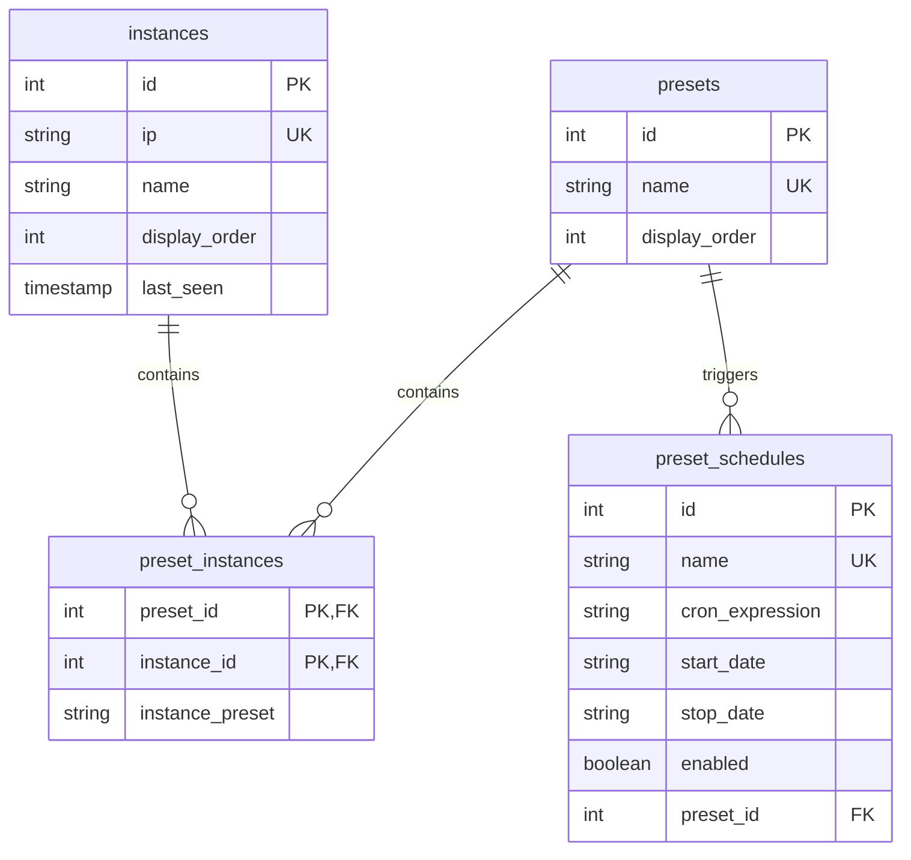

# WLED Control Backend API

A Node.js API for secure management of WLED devices, presets, and schedules. It proxies commands to devices and automates via cron.

## Features (Backend-Specific)

- **Proxying**: Forwards state changes to WLED IPs (e.g., `/json/state` endpoint).
- **Database**: SQLite for persistent storage of instances, presets, and schedules.
- **Validation**: IP checks, WLED compatibility tests, cron validation.
- **Automation**: `node-cron` for scheduling preset applications.
- **Security**: Rate limiting, helmet for headers, API key auth.

## API Endpoints

Base: `http://your-server:3000`. Auth: `X-API-Key` header/query.

### Instances
- `GET /api/instances`: List ordered instances.
- `POST /api/instances`: Create (validates IP/WLED).
- `PUT /api/instances/{id}`: Update IP/name.
- `DELETE /api/instances/{id}`: Delete (cleans orphans).
- `POST /api/instances/reorder`: Reorder via IDs.

### Presets
- `GET /api/presets`: List ordered presets.
- `GET /api/presets/{id}`: Details with instances.
- `POST /api/presets`: Create (unique name, valid instances).
- `PUT /api/presets/{id}`: Update name/instances.
- `DELETE /api/presets/{id}`: Delete.
- `POST /api/presets/{id}/apply`: Apply to devices.
- `POST /api/presets/reorder`: Reorder via IDs.

### Schedules
- `GET /api/schedules`: List with presets.
- `GET /api/schedules/{id}`: Details.
- `POST /api/schedules`: Create (valid cron).
- `PUT /api/schedules/{id}`: Update (clear dates with "CLEAR").
- `DELETE /api/schedules/{id}`: Delete (stops cron).

### WLED Proxy
- `GET /wled/{id}/presets.json`: Device presets.
- `GET /wled/{id}/state`: State.
- `POST /wled/{id}/state`: Set state (JSON body).
- `GET /wled/{id}/info`: Info.

## Error Handling

| Code | Description | Example |
|------|-------------|---------|
| 400  | Invalid input | Bad IP/cron. |
| 401  | Unauthorized | Missing key. |
| 404  | Not found | Invalid ID. |
| 408  | Timeout | Device offline. |
| 409  | Conflict | Duplicate name. |
| 500  | Server error | DB failure. |
| 502  | Bad gateway | WLED comms fail. |

## Database Schema

- **instances**: id, ip (unique), name, display_order, last_seen.
- **presets**: id, name (unique), display_order.
- **preset_instances**: preset_id, instance_id, instance_preset (JSON/state).
- **preset_schedules**: id, name (unique), cron_expression, start_date, stop_date, enabled, preset_id.




## Environment Variables

```env
PORT=3000
NODE_ENV=production
DB_PATH=/data/database.db
API_KEYS=your-key-123
ALLOWED_ORIGINS=mydomain.com
```

## Setup

(Refer to main README for cloning.)

1. Navigate: `cd backend`.
2. Install: `npm install`.
3. Config: Create `.env`.
4. Run: `node server.js`.
5. Health: `GET /health`.

## Key Functionalities Explained

- **server.js**: Entry point; sets up Express, middleware (CORS, helmet, auth), routes, and cron init.
- **api.js / wled.js**: Route definitions for instances/presets/schedules/WLED proxy.
- **instances.js / presets.js / schedules.js**: Controllers with DB queries, validation, transactions.
- **cronManager.js**: Manages cron jobs; starts/stops based on schedules, applies presets.
- **database.js**: Initializes SQLite schema with foreign keys.
- **controllers/wled.js**: WLED-specific commands (state get/set, presets fetch).

## Troubleshooting/FAQ

- **DB Errors**: Check `DB_PATH` permissions; run in production mode.
- **Cron Fails**: Validate expressions; check server time zone.
- **WLED Offline**: Ensure devices respond to `/json/info`.
- **Auth Issues**: Verify `API_KEYS` format (comma-separated).
- **CORS**: Update `ALLOWED_ORIGINS` for frontend access.
