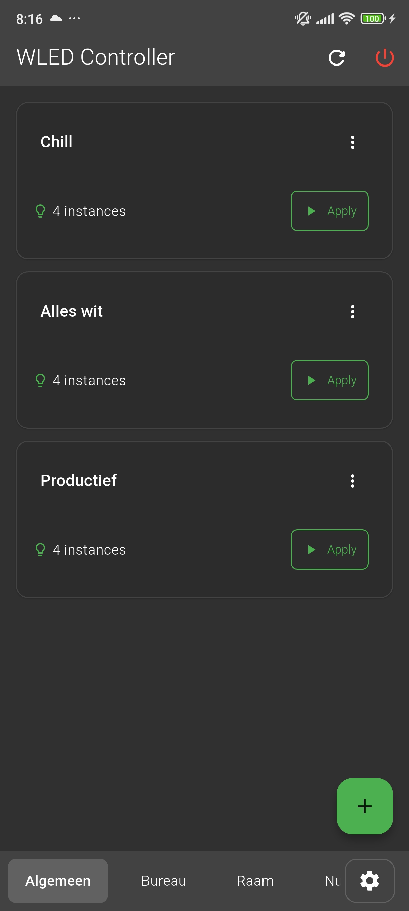
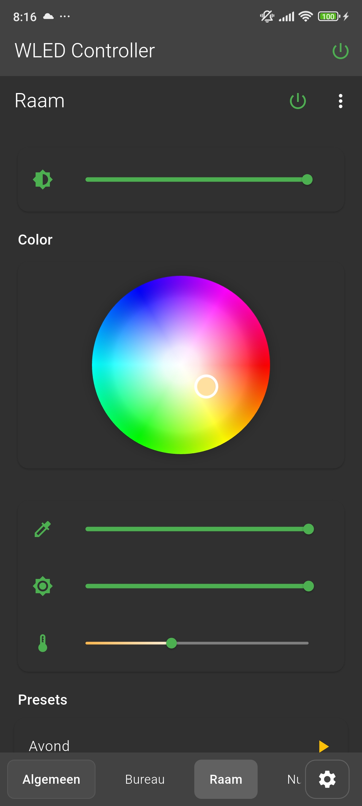
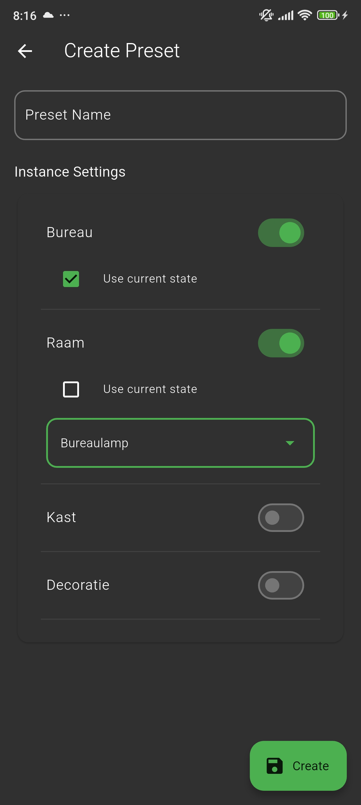
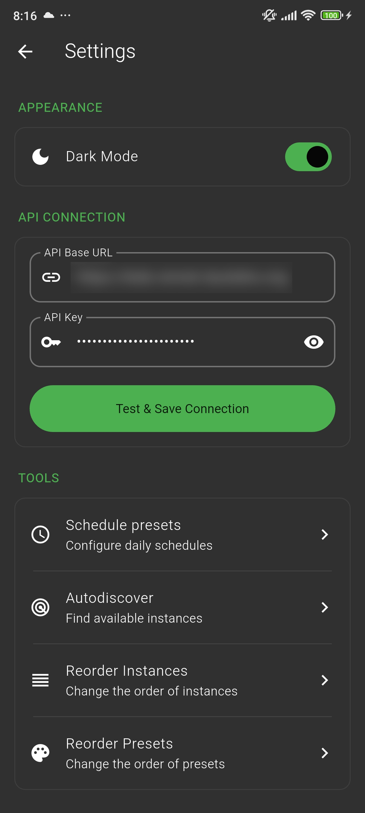
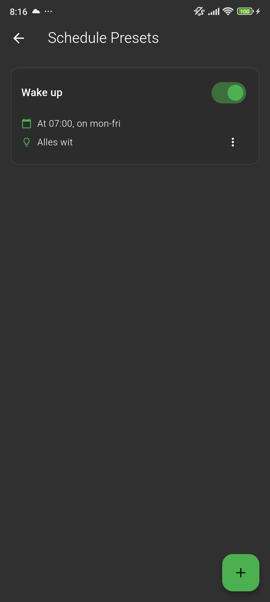
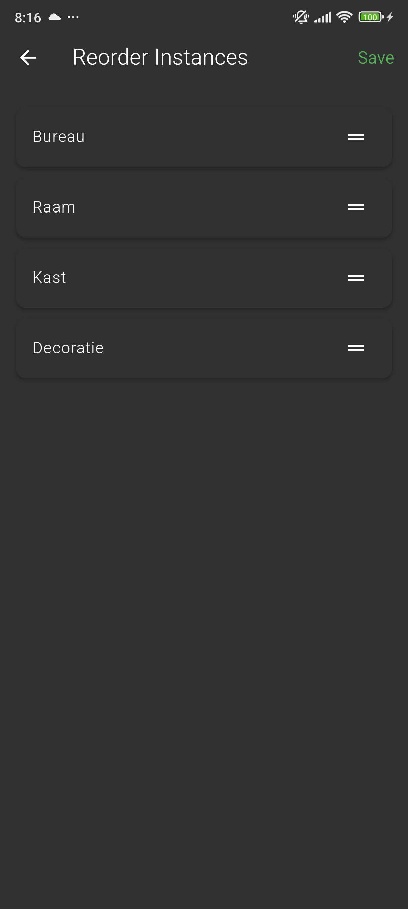

# WLED Dashboard Frontend

A Flutter app for controlling WLED devices via the backend API. It supports iOS, Android, and web, focusing on intuitive preset application and device management.

## Table of Contents

- [Features](#features)
- [Screenshots](#screenshots)
- [Installation](#installation)
- [Usage](#usage)
- [Configuration](#configuration)
- [Key functionalities](#key-functionalities-explained)
- [Dependencies](#dependencies)
- [Troubleshooting/FAQ](#troubleshootingfaq)

## Features (Frontend-Specific)

- **UI Components**: Tabbed navigation for presets, instances, and settings. Each instance screen offers sliders for brightness/CCT, color pickers, and preset lists.
- **State Management**: Uses Provider to cache device states, reducing API calls and enabling offline-like responsiveness.
- **Discovery**: mDNS-based auto-detection on mobile/desktop (via `multicast_dns`); not on web due to browser limits.
- **Theming**: Light/dark modes with custom colors; haptic feedback for interactions.
- **Performance**: Refresh indicators, loading states, and error handling for smooth UX.

## Screenshots

| Home Screen | Instance Control | Preset Edit |
|:-----------:|:----------------:|:-----------:|
|  |  |  |
| **Settings** | **Schedules** | **Reorder** |
|  |  |  |

## Installation

(Refer to main README for prerequisites/cloning.)

1. Navigate: `cd frontend`.
2. Install deps: `flutter pub get`.
3. Run: `flutter run` (or `flutter run -d chrome` for web).
4. Build: `flutter build apk` (Android), `flutter build ios` (iOS), or `flutter build web` (serve `build/web`).

## Usage

- **Settings**: Configure API URL/key; toggle themes.
- **Instances**: Swipe to refresh states; adjust power/brightness/colors per device.
- **Presets**: Create/edit (assign states to instances); tap to apply.
- **Schedules**: View/edit cron-based automations.

Pull-to-refresh for data sync.

## Configuration

- API settings stored in `shared_preferences`.
- Custom colors/themes in `main.dart`.
- Discovery limited to supported platforms.

## Key Functionalities Explained

- **api_service.dart**: Central hub for HTTP requests, caching states (e.g., `_instanceStates`), and notifying UI changes.
- **home_screen.dart**: Manages tabs; master power toggle checks/updates all instances.
- **instance_screen.dart**: Fetches device info/presets; updates states in real-time (e.g., color pickers merge changes).
- **presets_screen.dart**: Lists presets; handles apply/edit/delete with confirmations.
- **settings_screen.dart**: Form for API config; reorder screens for instances/presets.
- **wled_discovery_service.dart**: Uses MDnsClient to scan/discover/verify WLED devices.

## Dependencies

See `pubspec.yaml`. Key: `provider` (state), `http` (API), `shared_preferences` (storage), `multicast_dns` (discovery).

Update: `flutter pub upgrade`.

## Troubleshooting/FAQ

- **API Errors**: Check backend logs; ensure key matches `.env`.
- **Discovery Fails**: Same network? Permissions granted? Web unsupported.
- **State Not Syncing**: Use refresh button; check network.
- **Build Issues**: Ensure Flutter version >=3.0; clean with `flutter clean`.
